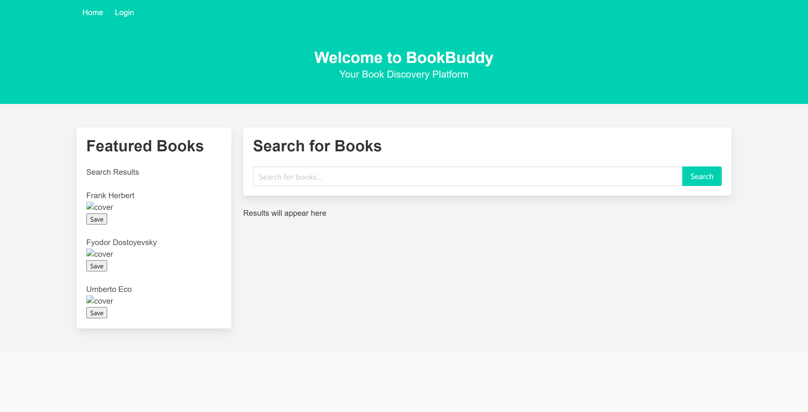

# BookBuddy - MVC App


Welcome to BookBuddy, your Book Discovery Platform!

## Description

BookBuddy is a web application that allows users to discover and manage their favorite books. This README provides an overview of the app's features and other relevant information.

## Table of Content
  * [Description](#description)
  * [Features](#features)
  * [Technologies](#Technologies)
  * [Installation](#installation)
  * [License](#license)
  * [Resources](#Resources)
  * [Deployment](#deployment)
  * [Questions](#questions)

## Features

BookBuddy offers the following features:

1. **Browse Books**: Users can browse a collection of books, view book details, and search for specific books.
2. **My Books**: Users can save and manage their favorite books. They can add, edit, and remove books from their collection.
3. **Book Details**: Users can view detailed information about each book, including the title, author, and description.
4. **User Authentication**: Secure user registration and login system to personalize the experience.
5. **Responsive Design**: The app is responsive and works on both desktop and mobile devices.

## License

This project is licensed under the [MIT License](LICENSE).

---

Thank you for using BookBuddy! We hope you enjoy discovering and managing your books.

## Technologies
* Visual Studio Code (VS Code).
* Git Workflow
* Heroku for temporary deployment
* Node JS with Express.js and NPM packages.
```
* "dependencies": {
    "bcrypt": "^5.0.1",
    "connect-session-sequelize": "^7.1.7",
    "dotenv": "^16.3.1",
    "express": "^4.18.2",
    "express-handlebars": "^7.1.2",
    "express-session": "^1.17.3",
    "mysql2": "^3.6.1",
    "nodemon": "^3.0.1",
    "sequelize": "^6.33.0"
  }
```
* GitHub Repository
* MySQL with Sequelize

## Installation
Run the command 'npm install' in the CLI and don't forget to add your 'name', 'user' and 'password' in the .env file as shown in the .env.Example for global environmental variables.

## Resources
* https://www.npmjs.com/package/bcrypt
* https://www.npmjs.com/package/connect-session-sequelize
* https://www.npmjs.com/package/dotenv
* https://www.npmjs.com/package/express
* https://www.npmjs.com/package/express-session
* https://www.npmjs.com/package/mysql2
* https://sequelize.org/docs/v6/getting-started/
* https://www.npmjs.com/package/nodemon


## Deployment
Temporary deployment link in Heroku:
* https://book-buddy-group-project-2-0373de53f1e7.herokuapp.com/

## Contributors
* https://github.com/wowzowski
* https://github.com/elchinatalpf
* https://github.com/srwesley
* https://github.com/tervinta

## Questions
For questions you can contact any of the four contributors above through our respective GitHub account.